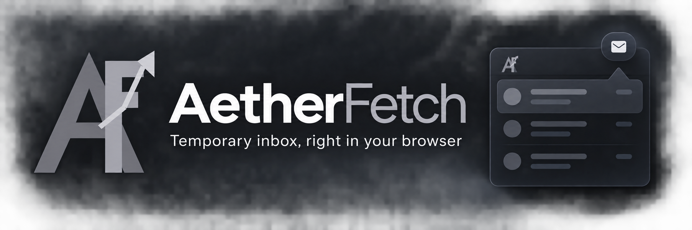

# AetherFetch Extension

A temporary inbox inside a browser popup for **Microsoft Edge and Mozilla Firefox**. Click the toolbar icon whenever a website asks for an email address. Create an address, copy it into the sign-up form, then read incoming messages and copy verification codes or open activation links without leaving the popup.

## Features

- Generate a temporary address using an available AetherFetch domain.
- Switch between addresses created in the extension.
- Check incoming messages in the popup and read plain text or text extracted from HTML mail.
- Detect verification codes and relevant activation links. Links open only when clicked, in a new tab; the destination domain is shown first.
- Refresh every 60 seconds **while the popup is open**, with a retry delay after rate limiting.

The extension uses [AetherFetch's existing mailbox API](https://aetherfetch.vercel.app/) and its mail.tm-backed delivery. Addresses created in the extension are separate from those saved on the website. There is no automatic access to the current tab, no code injection into websites, and no background polling.

## Install

### Edge

1. Download the repository as a ZIP and extract it.
2. Open `edge://extensions`, switch on **Developer mode**, and click **Load unpacked**.
3. Select the extracted directory containing `manifest.json`.

Open AetherFetch from the browser toolbar. Opening `popup.html` as a normal web page does not provide extension storage or API permissions.

### Firefox

1. Download the repository as a ZIP and extract it.
2. Open `about:debugging#/runtime/this-firefox` and click **Load Temporary Add-on**.
3. Select `manifest.json`. This temporary installation is removed when Firefox restarts. Permanent installation requires a signed add-on.

## Privacy

The extension asks for access to `https://aetherfetch.vercel.app/*` to call its mailbox API and uses browser `storage.local` to keep its created addresses, passwords and access tokens on this device. It reads email content only when you open a message. Avoid temporary mailboxes for important or long-term accounts. Anyone with access to your browser profile may be able to access stored inboxes. Remove the extension to clear its saved data.

The only network requests made by the popup are to AetherFetch's mailbox API, plus verification links you explicitly open. The browser may still fetch the website when you choose **Open website**.

## License

[MIT](LICENSE). Created by **qbpg**.
